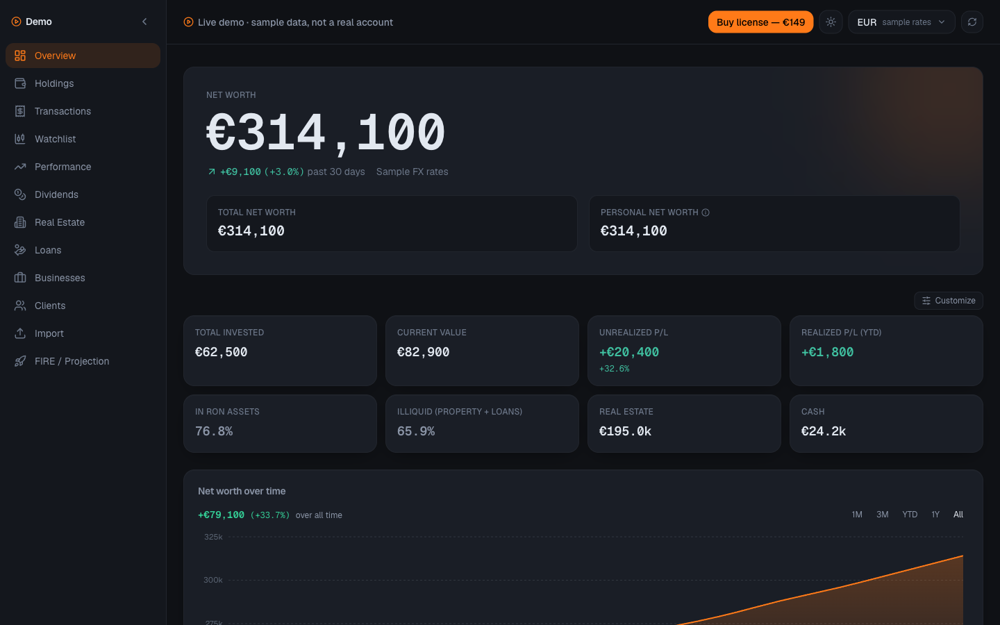
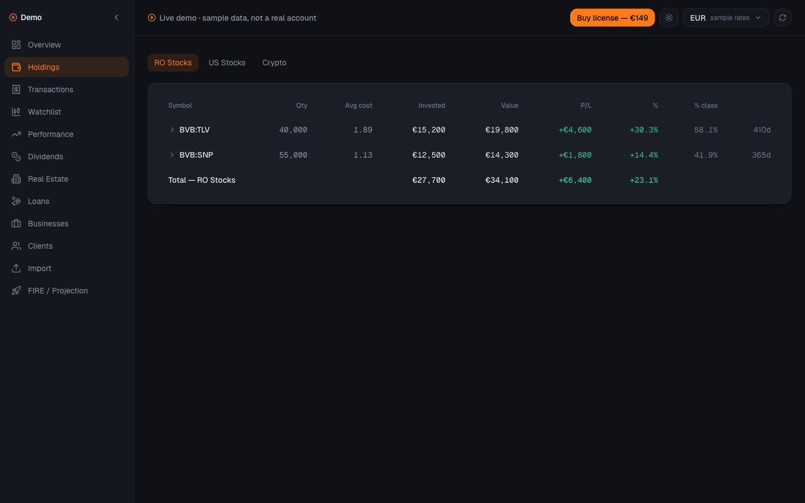
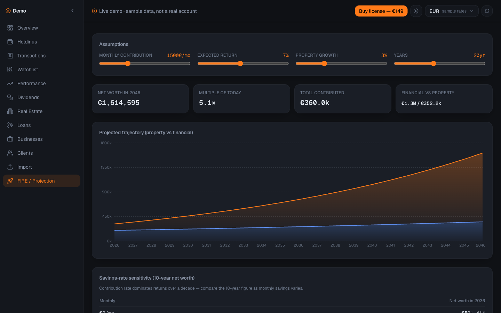
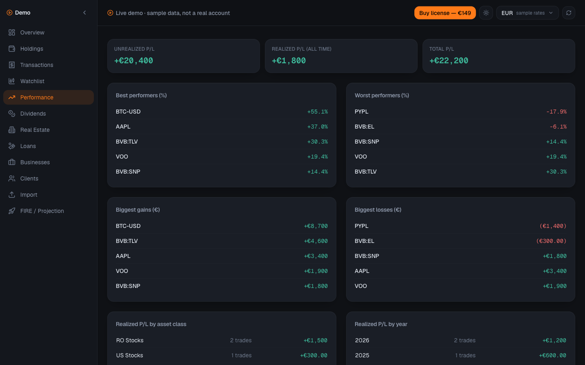

<p align="center">
  <picture>
    <source media="(prefers-color-scheme: dark)" srcset="public/logo-dark.png">
    
  </picture>
</p>

<h1 align="center">NomadWealth</h1>

<p align="center">
  <strong>Your entire net worth — not just your stocks. And we literally can't see it.</strong>
</p>

<p align="center">
  A self-hostable net-worth &amp; investment cockpit for people whose money doesn't fit in one app —<br />
  public holdings, real estate, private loans, business income, cash and crypto in one model,<br />
  in every currency you hold, with a FIRE projection — on <strong>your own</strong> Vercel and <strong>your own</strong> Neon Postgres.
</p>

<p align="center">
  
  
  
  
  
</p>

<p align="center">
  <a href="#-quick-start-one-click-no-terminal">Quick start</a> ·
  <a href="#whats-in-the-cockpit">Features</a> ·
  <a href="#the-privacy-invariant">Privacy</a> ·
  <a href="#screenshots">Screenshots</a> ·
  <a href="#environment-variables">Environment</a> ·
  <a href="#development">Development</a>
</p>

<p align="center">
  <a href="https://vercel.com/new/clone?repository-url=https%3A%2F%2Fgithub.com%2Fcostibotez%2Fnomadwealth&project-name=nomadwealth&repository-name=nomadwealth&env=SESSION_SECRET%2CSETUP_TOKEN&envDescription=SESSION_SECRET%20signs%20your%20login%20cookie%3B%20SETUP_TOKEN%20protects%20the%20first-run%20wizard%20until%20you%20finish%20it.&stores=%5B%7B%22type%22%3A%22integration%22%2C%22integrationSlug%22%3A%22neon%22%2C%22productSlug%22%3A%22neon%22%7D%5D"></a>
  <br />
  <a href="https://www.nomadwealth.app/demo">Live demo (sample data)</a> ·
  <a href="https://www.nomadwealth.app">Website</a> ·
  <a href="https://www.nomadwealth.app/security">Security &amp; privacy</a>
</p>

<p align="center">
  Author: <a href="https://www.nomad-developer.co.uk/">Costin Botez</a> (<a href="https://www.instagram.com/costinbotez/">@costinbotez</a>) ·
  <a href="https://www.nomad-developer.co.uk/">Portfolio</a> ·
  <a href="https://www.instagram.com/costinbotez/">Instagram</a> ·
  <a href="https://github.com/costibotez">GitHub</a>
</p>

---

## Why NomadWealth exists

Every wealth tracker shows you one slice: a brokerage account, a single currency, this year. If you also hold an apartment that pays rent, money lent to a friend at interest, a small business, and cash in three currencies, no app gives you *the* number. NomadWealth does — and it does it on infrastructure only you control:

- You open one screen and see **€X across everything you own** — holdings marked to live prices, property, loans with interest accrued to today, business income, cash — switchable between EUR / USD / GBP / RON at live FX.
- A stock crosses your alert price at 3am — your own install (not a vendor server) sends the push notification and email, and the incident shows up on your watchlist in the morning.
- And when you ask *"who can see this?"* the answer is architectural, not contractual: **nobody.** Your data lives in your Neon database, reached only by code running in your Vercel account. There is no vendor backend to breach.

## What's in the cockpit

### 🏦 One model for everything you own
- **Public holdings** — RO stocks (BVB), US stocks, crypto, REITs, mutual funds, gold; lots, cost basis, realized/unrealized P/L
- **Real estate** — properties with purchase basis, rent ledger, acquisition/sale costs and per-property returns
- **Private loans** — money you've lent, with receipts ledger, simple/compound interest accrued to today and IRR
- **Businesses & clients** — valuations, revenue/expense ledger, client retainers with renewal tracking
- **Cash & accounts** — personal and company cash across currencies, kept separate in the personal-vs-total split

### 🌍 Multi-currency, live
- Hold assets in **EUR · USD · GBP · RON**; read your net worth in the one you think in — switchable live, everywhere
- Live FX from keyless Frankfurter; stock prices from keyless Yahoo/BVB; optional CoinMarketCap key for crypto
- A daily cron refreshes prices and records a **net-worth snapshot**, building your history automatically

### 📈 Analytics, alerts & digests
- Performance over time, dividends with projected annual income, concentration flags, watchlist
- **Price alerts** delivered by browser push (keys minted on your install) and email through your own Resend key
- Weekly digest email; daily alert evaluation runs server-side even when no tab is open

### 🔥 FIRE projection
- A forward net-worth model with editable monthly contribution, expected return, property growth and horizon
- Savings-rate sensitivity table — see what dominates a decade: contributions or returns
- **Read-only share links** for your projection — the one thing you *can* choose to show someone

### 📥 Onboarding without pain
- First-run **setup wizard**: connect Neon, migrations run automatically, license verified offline, owner password set — no terminal
- **Web importer**: upload any bank/broker CSV or Excel export — parsed **in your browser** (the file never leaves your machine), mapped, previewed, committed per asset class

### 🔒 Private by design
- **No vendor data access, by architecture.** Your figures live in your Neon, reached only by code in your Vercel account
- No analytics that capture financial values; no error reporting with data payloads
- **Offline license activation** (Ed25519, embedded public key) — no phone-home; optional telemetry is opt-in and sends only a hashed key
- The app boots with just `DATABASE_URL` + `SESSION_SECRET` — zero vendor-side services
- Owner password hashed with PBKDF2 (Web Crypto), optional **TOTP two-factor** — no third-party auth service

## The privacy invariant

**No vendor data access — by architecture, not by promise.** There is no "our servers" in this product: you deploy the source to your Vercel, it talks to your Neon, and every optional integration (crypto prices, alert email) uses keys *you* bring. See [`SECURITY.md`](./SECURITY.md) and the public [security page](https://www.nomadwealth.app/security).

## ⚡ Quick start (one click, no terminal)

1. Click **Deploy with Vercel** above. Vercel clones this repo into **your** account and provisions **your** Neon Postgres via the native integration (`DATABASE_URL` is injected automatically).
2. When prompted, set `SESSION_SECRET` (any long random string — `openssl rand -base64 48`) and, recommended, `SETUP_TOKEN` (locks the first-run wizard to you until you finish it).
3. Open your new deployment — it boots straight into the **setup wizard**:
   - **1 · Neon** — confirms the connection and migrates the schema automatically
   - **2 · License & password** — paste the license key from your purchase email (verified offline, on your instance) and choose your owner password
   - **3 · Import** — upload a CSV/Excel export, or start from an empty cockpit
4. Finish → you land in your dashboard, signed in, on infrastructure only you hold the keys to.

## Screenshots

All taken from the [live demo](https://www.nomadwealth.app/demo) — fabricated sample data, because real ones would be nobody's business. That's the point.

| Overview | Holdings |
|---|---|
|  |  |

| FIRE projection | Performance |
|---|---|
|  |  |

## Environment variables

Only two are required to run:

| Variable | Required | What it's for |
| --- | :---: | --- |
| `DATABASE_URL` | ✅ | Your Neon Postgres connection string (auto-provisioned by the Vercel + Neon integration). |
| `SESSION_SECRET` | ✅ | Signs your login session cookie. Generate with `openssl rand -base64 48`. |
| `SETUP_TOKEN` | — | Recommended: locks the first-run wizard to you until setup is finished. Unset = no gate. |
| `DASHBOARD_PASSWORD` | — | Optional fallback password for the advanced/CLI path. The owner password set in the wizard takes precedence. |
| `CMC_API_KEY` | — | Your own CoinMarketCap key for live crypto prices (stocks use keyless Yahoo Finance). |
| `CRON_SECRET` | — | Authorizes the daily price-refresh / alert crons (auto-set on Vercel). |

Everything else in [`.env.example`](./.env.example) is optional and documented inline.

## Development

```bash
pnpm install
cp .env.example .env.local        # fill in DATABASE_URL + SESSION_SECRET
pnpm dev                          # http://localhost:3000 → first run redirects to /setup
```

- **Stack:** Next.js 15 (App Router) · TypeScript · Tailwind CSS · Drizzle ORM · Neon serverless Postgres · Zod · Server Actions · Node 24.
- **Runtime migrations, no drizzle-kit at deploy time:** SQL migrations are embedded in the bundle and applied over the Neon driver — by the setup wizard on first run, and automatically on the first request after any later deploy, so updates never leave your schema behind.
- **Tests:** `pnpm test` (Vitest — finance, valuation, import-parser and schema contract tests) · `pnpm typecheck` · `pnpm build`.

## License

Self-host license — see your purchase for terms. You get the full source and run it on your own infrastructure; the license gates use and updates, **never your data**.

---

<p align="center">
  
</p>

<p align="center">
  Built and maintained by <a href="https://www.nomad-developer.co.uk/">Costin Botez</a> — <a href="https://www.nomad-developer.co.uk/">Nomad Developer</a> · <a href="https://www.instagram.com/costinbotez/">@costinbotez</a><br />
  For people who want the whole picture, and want it private.
</p>
